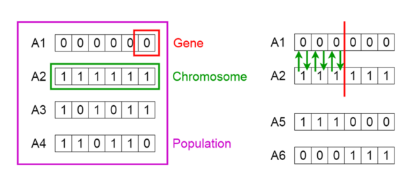

<!-- {{# generate.module_header{} #}} -->

# Module :: optimization_tools
<!--{ generate.module_header.start() }-->
 [](https://github.com/emersion/stability-badges#experimental) [](https://github.com/Wandalen/wTools/actions/workflows/module_optimization_tools_push.yml) [](https://docs.rs/optimization_tools) [](https://gitpod.io/#RUN_PATH=.,SAMPLE_FILE=module%2Fmove%2Foptimization_tools%2Fexamples%2Foptimization_tools_trivial.rs,RUN_POSTFIX=--example%20optimization_tools_trivial/https://github.com/Wandalen/wTools) [](https://discord.gg/m3YfbXpUUY)
<!--{ generate.module_header.end }-->

# Hybrid optimization using Simulated Annealing and Genetic Algorithm

## Simulated Annealing

Simulated Annealing is a probabilistic optimization algorithm inspired by the annealing process in metallurgy. It is often used to find near-optimal solutions to combinatorial optimization problems. Simulated Annealing is known for its ability to escape local optima and explore a broader solution space, making it suitable for complex optimization problems, like solving of sudoku puzzle.

Simulated Annealing starts with an initial solution and iteratively explores neighboring solutions. It accepts better solutions with certainty but occasionally accepts worse solutions with a decreasing probability over time. The algorithm maintains a temperature parameter that controls the likelihood of accepting worse solutions. As the algorithm progresses, the temperature decreases, and the acceptance of worse solutions becomes less probable.

### Resources:
   - [Video explanation](https://www.youtube.com/watch?v=21EDdFVMz8I)
   - [Wikipedia page](https://en.wikipedia.org/wiki/Simulated_annealing)

### Illustration of solving Traveling Salesman problem with Simulated Annealing


## Genetic Algorithm

A genetic algorithm (GA) is an optimization technique inspired by the principles of natural selection and genetics. It begins with a population of candidate solutions, randomly generated. Each candidate solution is evaluated using a fitness function that quantifies how well it solves the problem at hand. Solutions with higher fitness values are considered better.

To produce new population genetic operators are used: selection, crossover, mutation and elitism.
- Mutation introduces random changes (mutations) to some individuals to maintain diversity in the population and prevent premature convergence.
- Some individuals are replaced by offspring. First parent individuals are selected from the population based on their fitness. Individuals with higher fitness have a higher chance of being selected. Than selected individuals create offspring using crossover operator, which performs recombination of their genetic material. This mimics the mating process in natural genetics.



- Some most fit individuals(elites) are cloned to new population without changes.

These operations are performed repeatedly for a certain number of generations or until a termination condition is met (e.g., reaching a satisfactory solution).

The algorithm returns the best solution found in the final population, which represents an optimal or near-optimal solution to the problem.

### Resources:
   - [Video explanation](https://www.youtube.com/watch?v=S8LdYxA5-8U)
   - [Wikipedia page](https://en.wikipedia.org/wiki/Genetic_algorithm)

## Hybrid optimization

Hybrid optimization method, that performs iterative optimization using a combination of genetic algorithm and simulated annealing techniques, aiming to find an optimal or satisfactory solution to the given problem. It uses mutation, selection and crossover operators similar to genetic algorithm and evaluates vitality of candidate solution based on temperature as in simulated annealing.
There's two main methods in HybridOptimizer struct:
 - `optimize`: Creates the initial population of solutions, initializes variables needed for optimization loop. In the loop updates population until termination conditions are met, such as reaching the maximum number of dynasties, finding a satisfactory solution, or exceeding a reset limit.

 [Mermaid diagram of optimize method](diagram.md)

 - `evolve`: Updates an individual solution in an optimization process using either a crossover operator or a mutation operator. If candidate solution is vital, it is included in new population.

 [Mermaid diagram of evolve method](evolve_method_diagram.md)

## Problems

#### Sudoku Solving

Sudoku is a classic number puzzle game that involves filling a 9x9 grid with digits. The puzzle begins with some cells already filled with numbers, and the goal is to complete the grid following specific rules - every row, column and 3x3 block must contain unique digits from 1 to 9.

#### Traveling Salesman Problem

The Traveling Salesman Problem (TSP) is a classic optimization problem where the goal is, with given set of cities and the distances between each pair of cities, find the shortest possible tour that visits each city exactly once and returns to the starting city, forming a closed loop.

#### Example: Traveling Salesman Problem

```rust

// Create new graph with distances between edges.
let mut graph = TSPGraph::new();
graph.add_edge( NodeIndex( 1 ), NodeIndex( 2 ), 10.0 );
graph.add_edge( NodeIndex( 1 ), NodeIndex( 3 ), 15.0 );
graph.add_edge( NodeIndex( 1 ), NodeIndex( 4 ), 20.0 );
graph.add_edge( NodeIndex( 2 ), NodeIndex( 3 ), 35.0 );
graph.add_edge( NodeIndex( 2 ), NodeIndex( 4 ), 25.0 );
graph.add_edge( NodeIndex( 3 ), NodeIndex( 4 ), 30.0 );

// Create initial TS configuration, passing created graph and starting node.
let tsp_initial = TSProblem::new( graph, NodeIndex( 1 ) );

// Create hybrid optimization problem with TS configuration, crossover operator and mutation operator,
// specific for TS problem.
let tsp = Problem::new( tsp_initial, OrderedRouteCrossover{}, TSRouteMutation{} );

// Create new hybrid optimizer with default configuration, and TS hybrid optimization problem.
let optimizer = HybridOptimizer::new( Config::default(), tsp )
// If desired, update certain configuration values for optimizer.
.set_population_size( 100 )
.set_dynasties_limit( 100 );

// Perform optimization of given problem. Result includes best found solution and reason for termination
// of optimization process.
let ( reason, solution ) = optimizer.optimize();
// Result
// reason : DynastiesLimit
// route : [ NodeIndex(1), NodeIndex(2), NodeIndex(4), NodeIndex(3), NodeIndex(1)]
// distance : 80.0
```

#### Example of implementation of custom problem

Given a set of items, each with a weight, determine the subset of items with the total weight which is closest to a given baseline.

```rust
// Create struct that represents candidate solution and implement trait Individual for it.
pub struct SubsetPerson
{
  pub subset : Vec< bool >,
  pub value_diff : usize,
}

impl Individual for SubsetPerson
{
  fn fitness( &self ) -> usize
  {
    self.value_diff
  }
  fn is_optimal( &self ) -> bool
  {
    self.value_diff == 0
  }
  fn update_fitness( &mut self, value : f64 )
  {
    self.value_diff = value as usize;
  }
}

// Create struct that represents problem, and implement trait InitialProblem for it.
// Associated item is SubsetPerson created above.
pub struct SubsetProblem
{
  pub items_values : Vec< usize >,
  pub baseline : usize,
}

impl InitialProblem for SubsetProblem
{
  type Person = SubsetPerson;

  fn get_random_person( &self, hrng : Hrng ) -> SubsetPerson
  {
    let mut subset = vec![ false; self.items.len() ];

    // Create subset with random number of random items.
    ...

    // Create new person with subset.
    let mut person = SubsetPerson::new( subset );
    let diff = self.evaluate( &person );
    person.update_fitness( diff );

    person
  }

  fn evaluate( &self, person : &SubsetPerson ) -> f64
  {
    // Calculate difference between sum of subset elements and baseline.
    ...

    ( self.baseline - sum ).abs() as f64
  }
}

// Create crossover operator for custom problem, implement CrossoverOperator trait for it.
pub struct SubsetCrossover;
impl CrossoverOperator for SubsetCrossover
{
  type Person = SubsetPerson;
  fn crossover( &self, hrng : Hrng, parent1 : &Self::Person, parent2 : &Self::Person ) -> Self::Person
  {
    ...
    // Get random crossover point.
    let point = ( 1..parent1.subset.len() - 2 ).choose( &mut *rng ).unwrap();
    let child = parent1.subset.iter().cloned().take( point ).chain( parent2.subset.iter().cloned().skip( point ) ).collect_vec();

    SubsetPerson::new( child )
  }
}

// Create mutation operator for custom problem, implement MutationOperator trait for it.
pub struct SubsetMutation;

impl MutationOperator for SubsetMutation
{
  fn mutate( &self, hrng : Hrng, person : &mut Self::Person, _context : &Self::Problem )
  {
    ...
    // Remove random item.
    loop
    {
      let position = ( 0..person.subset.len() ).choose( &mut *rng ).unwrap();
      if person.subset[ position ] == true
      {
        person.subset[ position ] = false;
        break;
      }
    }

    // In the same way add random item to list.
    ...
  }
}
```

### Results

- [Sudoku Solving](sudoku_results.md)
- [Traveling Salesman](tsp_results.md)

## Finding optimal parameters for Hybrid Optimizer using Nelder-Mead algorithm

### About Nelder-Mead algorithm:

The Nelder-Mead method, also known as the downhill simplex method, is an optimization algorithm used to find the minimum of a function in a multidimensional space. It is useful for optimizing functions that are not well-behaved or have unknown derivatives. It has several stages:

- Simplex Initialization:
Calculate initial simplex, which is a geometric shape formed by n+1 points in an n-dimensional space. These points represent candidate solutions.

- Reflection, Expansion, Contraction, and Shrinkage:
During each iteration, the method evaluates the function at each simplex point. Based on these evaluations, it performs operations like reflection, expansion, contraction, or shrinkage to adjust the simplex.

- Updating Simplex:
Depending on the evaluation results, the simplex is updated to move towards the optimum. This process continues iteratively until a termination criterion is met.

- Termination:
Termination criteria includes reaching a maximum number of iterations or achieving a desired level of accuracy. The algorithm outputs the best point found, which corresponds to the minimum of the function.

### Illustration of usage for Himmelblau function


### More:
 - [Video explanation](https://www.youtube.com/watch?v=-GWze-wtu60)
 - [Wikipedia page](https://en.wikipedia.org/wiki/Nelder%E2%80%93Mead_method)

### Functions

- `optimize_by_time`: Wrapper around Nelder-Mead optimizer, which accepts config for Nelder-Mead algorithm, optimization problem starting values and objective function, and finds optimal values for minimal execution time of objective function.
- `find_hybrid_optimal_params`: Specific optimization of parameters of HybridOptimizer, uses function `optimize_by_time` for finding configuration of HybridOptimizer which provides minimal execution time.

### Example of usage with hybrid optimizer and traveling salesman problem
```rust
// Create default config for params optimization
let config = OptimalParamsConfig::default();

// Create initial traveling salesman problem with default graph, and starting node.
let initial = TSProblem { graph : TSPGraph::default(), starting_node : NodeIndex( 1 ) };

// Create hybrid problem with initial traveling salesman problem, and concrete operators implementations for traveling salesman problem.
let hybrid_problem = Problem::new( initial, OrderedRouteCrossover{}, TSRouteMutation{} );

// Using starting configuration for hybrid mode of optimization and hybrid problem, find optimal parameters for that problem.
let res = hybrid_opt_params::find_hybrid_optimal_params( config, optimization::starting_params_for_hybrid()?, hybrid_problem );
```
### To add to your project
```bash
cargo add optimization_tools
```

### Try out from the repository
``` shell test
git clone https://github.com/Wandalen/wTools
cd wTools
cd module/move/optimization_tools
cargo run --example traveling_salesman
cargo run --example custom_problem
```
