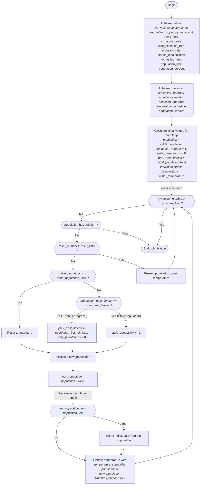

```mermaid
flowchart TB
    id1([Begin])
    -->
    id2["`Initialize values:
      *ga_max_stale_iterations*,
      *sa_mutations_per_dynasty_limit*,
      *reset_limit*,
      *crossover_rate*,
      elite_selection_rate,
      mutation_rate,
      fitness_recalculation,
      dynasties_limit,
      population_size,
      population_percent`"]
    -->
    id3["`Initialize operators:
      *crossover_operator*,
      *mutation_operator*,
      *selection_operator*,
      *temperature_scheduler*,
      *population_seeder*;`"]
    -->
    id4["`Calculate initial values for main loop:
        *population* = initial_population,
        *dynasties_number* = 1,
        *stale_generations* = 0,
        *prev_best_fitness = initial_population best individual fitness*,
        *temperature* = initial_temperature`"]
    -- enter main loop -->
    id5{{"`*dynasties_number* > *dynasties_limit* ?`"}}
    id5 -->|No| id6{{ population has solution ? }}
    id6 -->|No| id17{{"`*reset_number* > *reset_limit* ?`"}}
    id17 -->|No| id8{{"`*stale_populations* > *stale_population_limit* ?`"}}
    id17 -->|Yes| id9[ Reseed population, reset temperature ]
    id8 -->|No| id18{{"`*population_best_fitness* == *prev_best_fitness* ?`"}}
    id8 -->|Yes| id19[ Reset temperature ]
    id19 --> id12[ Initialaize new_population ]
    id18 -->|"No ( There's progress ) "| id10["`*prev_best_fitness* = *population_best_fitness*, *stale_populations* = 0;`"]
    id18 -->|"Yes (Stale population) "| id11["`*stale_population* += 1`"]
    id10 --> id12
    id11 --> id12
    id12 --> id13["`*new_population* = *population.evolve*`"]
    id13 -->|check new_population length| id14{{"`*new_population_len* < *population_len*`"}}
    id14 -->|Yes| id15[ Clone individuals from old population ]
    id14 -->|No| id16["`Update temperature with *temperature_scheduler*,
                    *population* = *new_population*,
                    *dynasties_number* += 1;`"]
    id15 --> id16
    id16 --> id5
    id9 --> id5
    id6 -->|Yes| id20([End optimization])
    id5 -->|Yes| id20

```