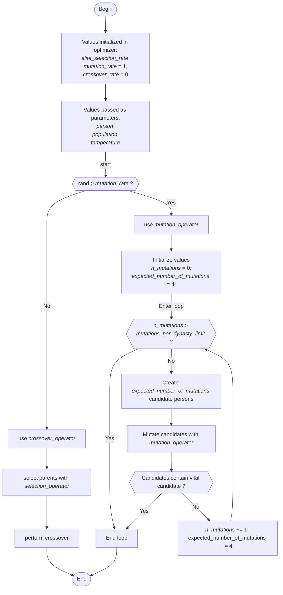

```mermaid
flowchart TB
    id1([Begin])
    -->
    id2["`Values initialized in optimizer:
      *elite_selection_rate*,
      *mutation_rate* = 1,
      *crossover_rate* = 0`"]
    -->
    id4["`Values passed as parameters:
        *person*,
        *population*,
        *tamperature*`"]
    -- start -->
    id6{{"`rand > *mutation_rate* ?`"}}
    id6 -->|No| id7["`use *crossover_operator* `"]
    id6 -->|Yes| id8["`use *mutation_operator* `"]
    id7 -->id9["`select parents with *selection_operator*`"]
    id9 -->id11["`perform crossover`"]
    id8 -->id12["`Initialize values
              *n_mutations* = 0;
              *expected_number_of_mutations* = 4;`"]
    id12 -- Enter loop --> id13{{"`*n_mutations* > *mutations_per_dynasty_limit* ?`"}}
    id13 -->|Yes| id14["End loop"]
    id13 -->|No| id15["`Create *expected_number_of_mutations* candidate persons`"]
    id15 -->id17["`Mutate candidates with *mutation_operator*`"]
    id17 -->id18{{"` Candidates contain vital candidate ?`"}}
    id18 -->|Yes| id14["End loop"]
    id18 -->|No| id19["`*n_mutations* += 1; 
                      expected_number_of_mutations += 4;`"]
    id19 --> id13
    id11 --> id16([End])
    id14 --> id16
    
    

```